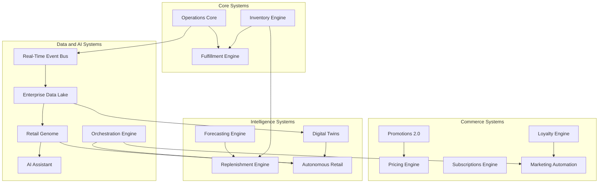

# Ordella Master Documentation Index

Central map of Ordella platform systems: what each does, where to read more, how systems connect, and a sensible learning path for new engineers.

**Shared references (all systems)**

| Resource | Path | Purpose |
|----------|------|---------|
| Software requirements | [srs-v7.md](./srs-v7.md) | Functional scope and lifecycle rules |
| API specification | [api-spec-v1.0.md](./api-spec-v1.0.md) | REST contracts (baseline; module routes below extend v1) |
| Architecture blueprint | [architecture-blueprint.md](./architecture-blueprint.md) | Platform-wide architecture style and core services |
| Entity relationship diagram | [erd.md](./erd.md) | Data model overview |
| Local development | [local-development.md](./local-development.md) | Run API, UIs, migrations, and infra locally |

**API base URL (local):** `http://localhost:3000/api/v1`  
**Admin UI (local):** `http://localhost:3001`

---

## How to Navigate This Documentation

1. **Start here** — Use this index to find a system by name or category.
2. **Read the system row** — Each entry has a short description, documentation path, and **Status**.
3. **Follow cross-links** — **Related systems**, **API**, and **Architecture** columns point to dependencies and integration surfaces.
4. **Implement or operate** — Use [local-development.md](./local-development.md) to run services; use module paths under `apps/api/src/modules/` when no dedicated doc page exists yet.
5. **Extend docs** — Canonical per-system pages live under [`docs/systems/`](./systems/) (create or expand as needed); this index remains the single entry point.

**Conventions**

- **Status:** `completed` = implemented in the Ordella monorepo (API module + Admin UI or consumer app where applicable).
- **API link:** Primary NestJS controller prefix; full path is `/api/v1/{prefix}`.
- **Architecture:** Platform diagram in [architecture-blueprint.md](./architecture-blueprint.md); module-specific behavior is documented in code under `apps/api/src/modules/{module}/`.

---

## Recommended Reading Order

For onboarding and platform understanding, read in this order:

| Order | Focus | Systems / docs |
|-------|--------|----------------|
| 1 | Platform foundations | [architecture-blueprint.md](./architecture-blueprint.md), [srs-v7.md](./srs-v7.md), [local-development.md](./local-development.md) |
| 2 | Core retail operations | Operations Core → Fulfillment Engine → Inventory Engine |
| 3 | Commerce & customers | Pricing Engine → Promotions 2.0 → Loyalty → Subscriptions → Marketing Automation |
| 4 | Workforce & supply | Staff Scheduling → Replenishment Engine → Forecasting Engine |
| 5 | Real-time & edge | Real-Time Event Bus → Offline Mode & Edge Sync → Hardware & IoT |
| 6 | Enterprise control plane | Multi-Location Enterprise Admin → Developer Platform → Integrations Hub |
| 7 | Data & intelligence | Enterprise Data Lake & ETL → Orchestration Engine → AI Assistant → Retail Genome |
| 8 | Simulation & autonomy | Digital Twins → Autonomous Retail Engine |
| 9 | Global & ecosystem | Globalization → App Store 2.0 → Global Partner Network |
| 10 | Trust & infrastructure | Compliance Suite → Ordella Cloud Platform |
| 11 | Customer-facing ops | Customer Support Suite |

---

## System Dependencies Map

High-level dependency flow (arrows read as “feeds” or “depends on”):

**Cross-cutting:** Authentication/RBAC, Audit Logs, and Tenant isolation underpin every module. **Compliance Suite** and **Ordella Cloud Platform** govern residency, security policy, and deployment topology without replacing domain modules.

---

## Core Systems

| System | Description | Documentation | Status | Related systems | API | Architecture |
|--------|-------------|---------------|--------|-----------------|-----|----------------|
| **Operations Core** | Orders, locations, catalog operations, POS/back-office workflows, and day-to-day store execution. | [systems/operations-core.md](./systems/operations-core.md) | completed | Fulfillment Engine, Inventory Engine, Real-Time Event Bus | `orders`, `locations`, `pos`, `catalog`, `products` — [api-spec-v1.0.md](./api-spec-v1.0.md) | [architecture-blueprint.md](./architecture-blueprint.md) |
| **Fulfillment Engine** | Warehouse picks, transfers, KDS/kitchen flow, and delivery assignment through order completion. | [systems/fulfillment-engine.md](./systems/fulfillment-engine.md) | completed | Operations Core, Inventory Engine, Hardware & IoT | `warehouse`, `picks`, `transfers`, `kds`, `deliveries`, `delivery-assignments` | [architecture-blueprint.md](./architecture-blueprint.md) |
| **Inventory Engine** | Stock levels, movements, adjustments, transfers, wastage, and multi-location inventory truth. | [systems/inventory-engine.md](./systems/inventory-engine.md) | completed | Replenishment Engine, Fulfillment Engine, Retail Genome | `inventory`, `stock-items`, `stock-movements`, `stock-adjustments`, `stock-transfers` | [architecture-blueprint.md](./architecture-blueprint.md) |

---

## Intelligence Systems

| System | Description | Documentation | Status | Related systems | API | Architecture |
|--------|-------------|---------------|--------|-----------------|-----|----------------|
| **AI Assistant** | Natural-language insights, suggested actions, and operational Q&A for managers. | [systems/ai-assistant.md](./systems/ai-assistant.md) | completed | Retail Genome, Analytics, Operations Core | `ai-assistant` | [architecture-blueprint.md](./architecture-blueprint.md) |
| **Forecasting Engine** | Demand forecasting, trend signals, and planning inputs for inventory and replenishment. | [systems/forecasting-engine.md](./systems/forecasting-engine.md) | completed | Replenishment Engine, Enterprise Data Lake, Autonomous Retail | `forecast` | [architecture-blueprint.md](./architecture-blueprint.md) |
| **Retail Genome Project** | Unified retail knowledge graph: entities, relationships, embeddings, reasoning, and privacy-preserving federated patterns. | [systems/retail-genome.md](./systems/retail-genome.md) | completed | Enterprise Data Lake, Real-Time Event Bus, AI Assistant, Autonomous Retail | `retail-genome` | [architecture-blueprint.md](./architecture-blueprint.md) |

---

## Operational Systems

| System | Description | Documentation | Status | Related systems | API | Architecture |
|--------|-------------|---------------|--------|-----------------|-----|----------------|
| **Replenishment Engine** | Automated replenishment proposals, transfer suggestions, and stock-up workflows. | [systems/replenishment-engine.md](./systems/replenishment-engine.md) | completed | Inventory Engine, Forecasting Engine, Procurement | `replenishment` | [architecture-blueprint.md](./architecture-blueprint.md) |
| **Staff Scheduling** | Shifts, coverage, and location-aware staff scheduling for retail operations. | [systems/staff-scheduling.md](./systems/staff-scheduling.md) | completed | Operations Core, Multi-Location Enterprise Admin | `staff-scheduling`, `staff` | [architecture-blueprint.md](./architecture-blueprint.md) |
| **Customer Support Suite** | Support inbox, tickets, customer context, and resolution workflows. | [systems/customer-support-suite.md](./systems/customer-support-suite.md) | completed | CRM, Operations Core, Notifications | `support` | [architecture-blueprint.md](./architecture-blueprint.md) |
| **Offline Mode & Edge Sync** | Offline-first POS/catalog/cart sync, conflict handling, and edge gateway patterns. | [systems/offline-edge-sync.md](./systems/offline-edge-sync.md) | completed | Operations Core, Hardware & IoT, Ordella Cloud Platform | `offline-sync`, `pos/offline` | [architecture-blueprint.md](./architecture-blueprint.md) |
| **Hardware & IoT Layer** | Devices, gateways, commands, and IoT telemetry for stores and warehouses. | [systems/hardware-iot.md](./systems/hardware-iot.md) | completed | Fulfillment Engine, Offline Mode, Ordella Cloud Platform | `hardware/devices` | [architecture-blueprint.md](./architecture-blueprint.md) |

---

## Commerce Systems

| System | Description | Documentation | Status | Related systems | API | Architecture |
|--------|-------------|---------------|--------|-----------------|-----|----------------|
| **Pricing Engine** | Price lists, tax-aware pricing, and catalog price resolution across channels. | [systems/pricing-engine.md](./systems/pricing-engine.md) | completed | Promotions 2.0, Globalization, Catalog | `tax`, `products`, `variants`, `promotions` | [architecture-blueprint.md](./architecture-blueprint.md) |
| **Promotions Engine 2.0** | Rules, conditions, coupons, and campaign-level discount execution. | [systems/promotions-engine.md](./systems/promotions-engine.md) | completed | Pricing Engine, Loyalty, Marketing Automation | `promotions`, `promotion-rules`, `promotion-conditions` | [architecture-blueprint.md](./architecture-blueprint.md) |
| **Loyalty Engine** | Points, tiers, rewards, and customer loyalty lifecycle. | [systems/loyalty-engine.md](./systems/loyalty-engine.md) | completed | CRM, Marketing Automation, Subscriptions | `loyalty`, `public/loyalty` | [architecture-blueprint.md](./architecture-blueprint.md) |
| **Subscriptions Engine** | Subscription plans, billing cycles, and recurring commerce. | [systems/subscriptions-engine.md](./systems/subscriptions-engine.md) | completed | Payments, Loyalty, Billing | `subscriptions` | [architecture-blueprint.md](./architecture-blueprint.md) |
| **Marketing Automation** | Campaigns, segments, and outbound marketing orchestration. | [systems/marketing-automation.md](./systems/marketing-automation.md) | completed | CRM, Retail Genome, Notifications, Orchestration | `campaigns`, `segments` | [architecture-blueprint.md](./architecture-blueprint.md) |

---

## Enterprise Systems

| System | Description | Documentation | Status | Related systems | API | Architecture |
|--------|-------------|---------------|--------|-----------------|-----|----------------|
| **Multi-Location Enterprise Admin** | HQ analytics, franchise controls, enterprise regions, and cross-store governance. | [systems/enterprise-admin.md](./systems/enterprise-admin.md) | completed | Operations Core, Compliance Suite, Ordella Cloud Platform | `enterprise`, `hq`, `regions` | [architecture-blueprint.md](./architecture-blueprint.md) |
| **Compliance Suite** | SOC 2, ISO 27001, PCI, GDPR/residency controls, audit center, and enterprise procurement artifacts. | [systems/compliance-suite.md](./systems/compliance-suite.md) | completed | Audit Logs, Ordella Cloud Platform, Auth/SSO | `compliance-suite`, `compliance-suite/auditor` | [architecture-blueprint.md](./architecture-blueprint.md) |
| **Ordella Cloud Platform** | SaaS regions, multi-cloud, edge regions, residency, routing, and zero-downtime deployments. | [systems/cloud-platform.md](./systems/cloud-platform.md) | completed | Compliance Suite, Offline & Edge, Hardware & IoT | `cloud-platform` | [architecture-blueprint.md](./architecture-blueprint.md) |

---

## Infrastructure Systems

| System | Description | Documentation | Status | Related systems | API | Architecture |
|--------|-------------|---------------|--------|-----------------|-----|----------------|
| **Developer Platform** | API keys, developer console, webhooks, and integration lifecycle for partners and tenants. | [systems/developer-platform.md](./systems/developer-platform.md) | completed | Integrations Hub, Real-Time Event Bus, App Store 2.0 | `developer`, `api-keys`, `webhooks` | [architecture-blueprint.md](./architecture-blueprint.md) |
| **Integrations Hub** | Third-party apps, providers, integration logs, and connection management. | [systems/integrations-hub.md](./systems/integrations-hub.md) | completed | Developer Platform, App Store 2.0, Event Bus | `integrations`, `integrations/apps`, `integration-providers`, `integration-logs` | [architecture-blueprint.md](./architecture-blueprint.md) |
| **Real-Time Event Bus** | Durable event store, topics, publish/subscribe, and replay for event-driven workflows. | [systems/event-bus.md](./systems/event-bus.md) | completed | Enterprise Data Lake, Orchestration, Retail Genome | `event-bus` | [architecture-blueprint.md](./architecture-blueprint.md) §2.3 |

---

## Ecosystem Systems

| System | Description | Documentation | Status | Related systems | API | Architecture |
|--------|-------------|---------------|--------|-----------------|-----|----------------|
| **App Store 2.0** | Marketplace apps, installs, partner listings, and tenant-scoped app governance. | [systems/app-store.md](./systems/app-store.md) | completed | Integrations Hub, Global Partner Network, Developer Platform | `app-store` | [architecture-blueprint.md](./architecture-blueprint.md) |
| **Global Partner Network** | Partner onboarding, marketplace expansion, commissions, and partner portal. | [systems/partner-network.md](./systems/partner-network.md) | completed | App Store 2.0, Developer Platform, Compliance Suite | `partner-network`, `partner-network/portal` | [architecture-blueprint.md](./architecture-blueprint.md) |

---

## Autonomous Systems

| System | Description | Documentation | Status | Related systems | API | Architecture |
|--------|-------------|---------------|--------|-----------------|-----|----------------|
| **Autonomous Retail Engine** | Policy-driven autonomous decisions, safety constraints, and closed-loop retail actions. | [systems/autonomous-retail.md](./systems/autonomous-retail.md) | completed | Retail Genome, Orchestration, Digital Twins, Forecasting | `autonomous-retail` | [architecture-blueprint.md](./architecture-blueprint.md) |

---

## Global Systems

| System | Description | Documentation | Status | Related systems | API | Architecture |
|--------|-------------|---------------|--------|-----------------|-----|----------------|
| **Globalization & Multi-Currency Engine** | Locales, currencies, tax regions, compliance profiles, and cross-border retail configuration. | [systems/globalization.md](./systems/globalization.md) | completed | Pricing Engine, Compliance Suite, Ordella Cloud Platform | `globalization` | [architecture-blueprint.md](./architecture-blueprint.md) |

---

## Data & AI Systems

| System | Description | Documentation | Status | Related systems | API | Architecture |
|--------|-------------|---------------|--------|-----------------|-----|----------------|
| **Enterprise Data Lake & ETL** | Zones, pipelines, streaming ingest from Event Bus, feature store, and governed exports. | [systems/data-lake.md](./systems/data-lake.md) | completed | Real-Time Event Bus, Retail Genome, Forecasting | `data-lake` | [architecture-blueprint.md](./architecture-blueprint.md) |
| **Orchestration Engine** | Workflow definitions, triggers, and cross-system automation (including graph-based triggers). | [systems/orchestration.md](./systems/orchestration.md) | completed | Event Bus, Marketing Automation, Autonomous Retail | `orchestration` | [architecture-blueprint.md](./architecture-blueprint.md) |
| **Digital Twins** | Store, supply chain, and regional digital twins for simulation and what-if analysis. | [systems/digital-twins.md](./systems/digital-twins.md) | completed | Autonomous Retail, Enterprise Data Lake, Retail Genome | `digital-twins` | [architecture-blueprint.md](./architecture-blueprint.md) |

---

## Quick lookup by Admin UI route

| Admin UI | System |
|----------|--------|
| `/dashboard`, `/orders`, `/catalog`, `/locations` | Operations Core |
| `/warehouse`, `/inventory` | Fulfillment / Inventory |
| `/replenishment` | Replenishment Engine |
| `/forecasting` | Forecasting Engine |
| `/promotions`, `/loyalty`, `/subscriptions` | Commerce |
| `/marketing/campaigns` | Marketing Automation |
| `/support` | Customer Support Suite |
| `/staff/scheduling` | Staff Scheduling |
| `/enterprise`, `/franchise-hq` | Multi-Location Enterprise Admin |
| `/developer`, `/integrations-hub` | Developer / Integrations |
| `/app-store` | App Store 2.0 |
| `/partner-network` | Global Partner Network |
| `/event-bus` | Real-Time Event Bus |
| `/offline-sync` | Offline Mode & Edge Sync |
| `/devices` | Hardware & IoT |
| `/globalization` | Globalization |
| `/data-lake` | Enterprise Data Lake & ETL |
| `/orchestration` | Orchestration Engine |
| `/digital-twins` | Digital Twins |
| `/autonomous-retail` | Autonomous Retail Engine |
| `/ai-assistant` | AI Assistant |
| `/compliance-suite` | Compliance Suite |
| `/cloud-platform` | Ordella Cloud Platform |
| `/retail-genome` | Retail Genome Project |

---

## Module index (API source)

| Module path | System |
|-------------|--------|
| `apps/api/src/modules/orders` | Operations Core |
| `apps/api/src/modules/warehouse`, `kds`, `deliveries` | Fulfillment Engine |
| `apps/api/src/modules/inventory` | Inventory Engine |
| `apps/api/src/modules/promotions`, `tax` | Pricing / Promotions |
| `apps/api/src/modules/loyalty` | Loyalty Engine |
| `apps/api/src/modules/subscriptions` | Subscriptions Engine |
| `apps/api/src/modules/marketing` | Marketing Automation |
| `apps/api/src/modules/support` | Customer Support Suite |
| `apps/api/src/modules/forecast` | Forecasting Engine |
| `apps/api/src/modules/replenishment` | Replenishment Engine |
| `apps/api/src/modules/staff-scheduling` | Staff Scheduling |
| `apps/api/src/modules/enterprise`, `hq` | Multi-Location Enterprise Admin |
| `apps/api/src/modules/integrations`, `developer` (integrations) | Developer Platform / Integrations Hub |
| `apps/api/src/modules/app-store` | App Store 2.0 |
| `apps/api/src/modules/hardware` | Hardware & IoT |
| `apps/api/src/modules/ai-assistant` | AI Assistant |
| `apps/api/src/modules/offline-sync` | Offline Mode & Edge Sync |
| `apps/api/src/modules/event-bus` | Real-Time Event Bus |
| `apps/api/src/modules/globalization` | Globalization |
| `apps/api/src/modules/data-lake` | Enterprise Data Lake & ETL |
| `apps/api/src/modules/orchestration` | Orchestration Engine |
| `apps/api/src/modules/digital-twins` | Digital Twins |
| `apps/api/src/modules/autonomous-retail` | Autonomous Retail Engine |
| `apps/api/src/modules/partner-network` | Global Partner Network |
| `apps/api/src/modules/compliance-suite` | Compliance Suite |
| `apps/api/src/modules/cloud-platform` | Ordella Cloud Platform |
| `apps/api/src/modules/retail-genome` | Retail Genome Project |

---

## Document maintenance

When adding a new platform system:

1. Add a row to the appropriate section table above.
2. Create or update `docs/systems/{slug}.md`.
3. Register API routes and Admin UI nav.
4. Update this index’s **System Dependencies Map** and **Recommended Reading Order** if dependencies change.

*Last indexed: platform modules through migrations `1737650000088` (Retail Genome).*
