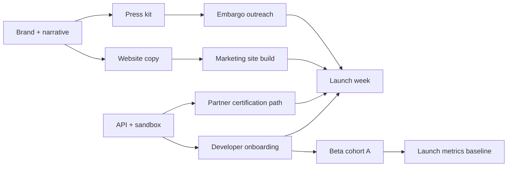

# Ordella Launch — Timeline

Integrated schedule from **6 weeks pre-launch** through **launch day** and **30 days post-launch**. Dates are **relative (T-N / L-day / D+N)**—anchor `L-day` to your chosen public launch date.

**Related:** [Launch overview](./LAUNCH_OVERVIEW.md) · [Checklist](./CHECKLIST.md) · [Communication plan](./COMMUNICATION_PLAN.md) · [Rollout strategy](../../beta-program/ROLL_OUT_STRATEGY.md)

---

## 6-week pre-launch timeline

| Week | Label | Focus | Key deliverables |
|------|-------|-------|------------------|
| **T-6** | Foundation | Narrative + governance | [LAUNCH_NARRATIVE](../LAUNCH_NARRATIVE.md) signed off; [brand](../../brand/BRAND_OVERVIEW.md) locked; [ASSET_STATUS](./ASSET_STATUS.md) owners assigned |
| **T-5** | Content | Website + docs copy | [website/copy](../../website/copy/homepage.md) wired to pages; [docs/public](../../docs/public/index.md) nav/config; [MASTER_INDEX](../../docs/MASTER_INDEX.md) updated |
| **T-4** | Builders | Developer surfaces | [developer-onboarding](../../developer-onboarding/OVERVIEW.md) live; [Developer Portal](../../developer-portal/README.md) routes; sandbox stable |
| **T-3** | Ecosystem | Partners + beta | [partner-program](../../partner-program/PROGRAM_OVERVIEW.md) published; [beta-program](../../beta-program/PROGRAM_OVERVIEW.md) cohort A active; [press-kit](../../press-kit/COMPANY_BOILERPLATE.md) ready |
| **T-2** | Hardening | QA + legal | Security/compliance review packs; rate limits; load test; legal terms on signup |
| **T-1** | Rehearsal | Dry runs | Launch day runbook; comms templates sent test; video final; embargoed press briefed |

**Dependencies (pre-launch):**

- **Website build** depends on **website/copy** and **brand** tokens.  
- **Developer onboarding** depends on **sandbox + API** stability.  
- **Partner launch** depends on **partner-program** docs + portal partner routes.  
- **Press** depends on **press-kit** + approved **FACT_SHEET** numbers/regions.  
- **Beta** should hit Phase 1 exit gates ([beta SUCCESS_METRICS](../../beta-program/SUCCESS_METRICS.md)) before **T-1**.

---

## Launch week timeline

Assume **L-day = public announcement Tuesday** (adjustable).

| Day | Activities |
|-----|------------|
| **L-5 (Mon)** | Internal all-hands preview; support on-call roster; status page verified |
| **L-4** | Partner embargo brief; beta cohort “launch eve” email ([beta COMMUNICATION](../../beta-program/COMMUNICATION_PLAN.md)) |
| **L-3** | Press pre-brief under embargo; final [CHECKLIST](./CHECKLIST.md) sign-off |
| **L-2** | Soft launch: docs + developer portal public; monitoring dashboards green |
| **L-1** | Website dark-launch QA; social posts scheduled; video uploaded unlisted |
| **L-day** | See [Launch day timeline](#launch-day-timeline) |
| **L+1** | Retrospective hot wash; partner office hours; monitor metrics |

**Dependency:** L-2 public docs **before** L-day marketing splash so developer links do not 404.

---

## Launch day timeline

All times **UTC placeholder**—shift to primary market.

| Time | Stream | Action |
|------|--------|--------|
| **06:00** | Internal | War room open; exec sign-off message |
| **07:00** | Platform | Final health check; freeze non-critical deploys |
| **08:00** | Web | **ordella.com** live (or feature flag on) |
| **08:15** | Docs | **docs.ordella.com** banner + [changelog](../../docs/public/changelog.md) entry |
| **08:30** | Developers | Blog/post: [developer-onboarding](../../developer-onboarding/OVERVIEW.md); portal signup open |
| **09:00** | Video | [Launch video](../video/VIDEO_SCRIPT.md) public (site + YouTube) |
| **09:30** | Partners | Partner program announcement + apply CTA ([partners copy](../../website/copy/partners.md)) |
| **10:00** | Press | Press release + [boilerplate](../../press-kit/COMPANY_BOILERPLATE.md); wire (placeholder) |
| **10:00–14:00** | Social | Threaded posts per [COMMUNICATION_PLAN](./COMMUNICATION_PLAN.md) |
| **14:00** | Retail | Retailer demo CTA / contact funnel live |
| **16:00** | Investors | Optional briefing (not public) using [pitch deck](../../pitch-deck/DECK_STRUCTURE.md) |
| **18:00** | Internal | Day-1 metrics snapshot vs [LAUNCH_OVERVIEW](./LAUNCH_OVERVIEW.md) |
| **22:00** | Platform | On-call handoff; incident commander remains |

**Dependency:** Press **after** website and docs URLs resolve; video **after** site embed ready.

---

## Post-launch 30-day timeline

| Period | Focus | Tasks |
|--------|-------|-------|
| **D+1–7** | Stabilize | Triage feedback ([FEEDBACK_LOOP](../../beta-program/FEEDBACK_LOOP.md)); hotfix docs; daily metrics email |
| **D+8–14** | Activate | Developer webinar; partner office hours; first case study draft ([CO_MARKETING](../../partner-program/CO_MARKETING.md)) |
| **D+15–21** | Expand | Beta Cohort B invites ([ROLL_OUT](../../beta-program/ROLL_OUT_STRATEGY.md)); API reference expansion |
| **D+22–30** | Review | Launch retro; update [ASSET_STATUS](./ASSET_STATUS.md); GA/pricing decisions ([pricing copy](../../website/copy/pricing.md)) |

| Milestone | Target day |
|-----------|------------|
| First certified partner listing (if ready) | D+21 |
| Press follow-up stories | D+10–20 |
| Launch metrics report to leadership | D+30 |
| Post-launch changelog rhythm established | D+7 |

**Dependencies:** Cohort B **after** D+7 stability; marketplace listings **after** partner certification path proven.

---

## Critical path summary

1. Brand/narrative → website + press  
2. API/sandbox → developer onboarding → launch developer message  
3. Partner docs → partner comms → marketplace (post-launch)  
4. Beta metrics → GA confidence → broad retailer campaign  

See [RISK_MITIGATION.md](./RISK_MITIGATION.md) if critical path slips >1 week.
